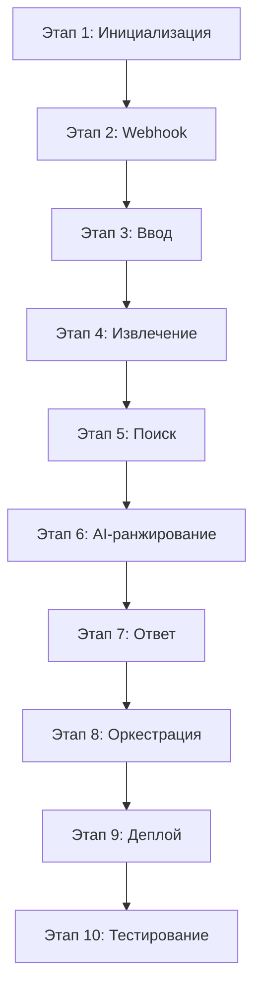

# План реализации FindOrigin

Поэтапный порядок действий по реализации Telegram-бота на основе [PROJECT.md](./PROJECT.md).

---

## Этап 1. Инициализация проекта

1. Создать Next.js-приложение (App Router, TypeScript).
2. Настроить переменные окружения:
   - `BOT_TOKEN` — токен Telegram-бота
   - `TELEGRAM_WEBHOOK_SECRET` — секрет для проверки webhook
   - `OPENAI_API_KEY` (или аналог) — для AI-сравнения смысла
   - `TAVILY_API_KEY` / `SERPER_API_KEY` (или аналог) — для веб-поиска источников
3. Добавить `.env.example` с описанием переменных (без секретов).
4. Подготовить базовую структуру каталогов:

```
app/
  api/
    telegram/
      webhook/
        route.ts      # POST-обработчик webhook
lib/
  telegram/           # клиент Telegram API
  parser/             # извлечение текста из ссылок
  extractor/          # выделение сущностей из текста
  search/             # поиск возможных источников
  ai/                 # сравнение смысла и ранжирование
  types/              # общие типы
```

---

## Этап 2. Telegram webhook (быстрый ответ)

1. Реализовать `POST /api/telegram/webhook`:
   - принимать `update` от Telegram;
   - извлекать `chat.id` и `text` из `update.message`;
   - игнорировать пустые и неподдерживаемые сообщения.
2. Реализовать клиент `sendMessage` через Telegram Bot API.
3. Обеспечить быстрый ответ **200 OK**:
   - тяжёлую обработку запускать асинхронно (не блокировать webhook);
   - сразу отправлять пользователю короткое подтверждение («Ищу источники…»).
4. Добавить скрипт или route для регистрации webhook (`setWebhook`) на Vercel URL.
5. Проверить локально через ngrok или сразу на Vercel.

**Критерий готовности:** бот отвечает на любое текстовое сообщение в течение 1–2 секунд.

---

## Этап 3. Приём и нормализация ввода

1. Определить тип входных данных:
   - обычный текст;
   - ссылка на Telegram-пост (`t.me/...`).
2. Для обычного текста — использовать как есть (с базовой очисткой).
3. Для ссылки на Telegram-пост:
   - распознать формат URL;
   - извлечь текст поста (через публичный preview / парсинг HTML / Telegram API, если доступно);
   - вернуть понятную ошибку, если пост недоступен.
4. Валидировать минимальную длину текста; при слишком коротком запросе — попросить больше контекста.

**Критерий готовности:** на вход «текст» и «ссылка на пост» получаем единый нормализованный текст для дальнейшей обработки.

---

## Этап 4. Извлечение сущностей из текста

1. Реализовать модуль `extractor`, который из нормализованного текста выделяет:
   - ключевые утверждения (1–5 главных тезисов);
   - даты;
   - числа;
   - имена (люди, организации);
   - ссылки, уже присутствующие в тексте.
2. Использовать AI (structured output / JSON schema) для надёжного извлечения.
3. Описать TypeScript-типы результата, например:

```ts
interface ExtractedData {
  claims: string[];
  dates: string[];
  numbers: string[];
  names: string[];
  links: string[];
  summary: string;
}
```

4. Добавить unit-тесты на типовые кейсы (новость, цитата, короткий пост).

**Критерий готовности:** из произвольного текста стабильно получается структурированный объект для поиска.

---

## Этап 5. Поиск возможных источников

1. Сформировать поисковые запросы на основе извлечённых данных:
   - комбинации ключевых утверждений + имён + дат;
   - отдельные запросы по числам и событиям.
2. Интегрировать API веб-поиска (Tavily, Serper, Bing и т.п.).
3. Фильтровать и группировать результаты по типам:
   - официальные сайты (gov, org, официальные пресс-релизы);
   - новостные сайты;
   - блоги;
   - исследования (arxiv, pubmed, academic domains).
4. Убрать дубликаты и явный мусор (агрегаторы без контента, соцсети-копии).
5. Оставить топ 10–15 кандидатов для AI-оценки.

**Критерий готовности:** для тестового текста возвращается список релевантных URL разных типов.

---

## Этап 6. AI-сравнение смысла и ранжирование

1. Для каждого кандидата получить текст страницы (fetch + извлечение основного контента).
2. Передать в AI:
   - исходный текст/утверждения пользователя;
   - текст кандидата;
   - инструкцию сравнивать **смысл**, а не дословное совпадение.
3. Получить от AI для каждого источника:
   - оценку уверенности (0–100% или low/medium/high);
   - краткое обоснование («почему это источник»).
4. Отобрать **1–3 лучших** результата.
5. Если уверенность низкая у всех — честно сообщить, что надёжный источник не найден.

**Критерий готовности:** бот возвращает 1–3 ссылки с оценкой и пояснением.

---

## Этап 7. Форматирование ответа пользователю

1. Сформировать читаемое сообщение в Telegram (Markdown/HTML):
   - краткое резюме запроса;
   - список источников с ссылками;
   - уровень уверенности для каждого;
   - короткое объяснение.
2. Обработать ошибки:
   - не удалось извлечь текст из ссылки;
   - поиск не дал результатов;
   - таймаут AI/поиска.
3. Ограничить длину сообщения под лимиты Telegram (разбить на части при необходимости).

**Критерий готовности:** ответ понятен пользователю без технических деталей.

---

## Этап 8. Оркестрация пайплайна

1. Связать все модули в единый pipeline:

```
ввод → нормализация → извлечение сущностей → поиск → AI-ранжирование → ответ
```

2. Добавить таймауты и fallback на каждом шаге.
3. Логировать ключевые этапы (без секретов и персональных данных).
4. При необходимости — простая in-memory / Vercel KV очередь, чтобы не терять задачи при cold start.

**Критерий готовности:** полный цикл работает end-to-end от сообщения пользователя до финального ответа.

---

## Этап 9. Деплой на Vercel

1. Подключить репозиторий к Vercel.
2. Настроить Environment Variables в Vercel Dashboard.
3. Задеплоить production-сборку.
4. Зарегистрировать webhook на `https://<domain>/api/telegram/webhook`.
5. Проверить работу бота в production.

**Критерий готовности:** бот стабильно работает на Vercel без ручного вмешательства.

---

## Этап 10. Тестирование и доработка

1. Прогнать сценарии:
   - короткий текст;
   - длинная новость;
   - ссылка на Telegram-пост;
   - текст с уже известным первоисточником;
   - текст без публичных источников.
2. Замерить время ответа; при необходимости оптимизировать (параллельный поиск, кэш).
3. Добавить README с инструкцией по запуску и деплою.
4. По результатам тестов скорректировать промпты AI и фильтры поиска.

**Критерий готовности:** бот даёт полезные результаты на реальных примерах, webhook не падает по таймауту.

---

## Порядок приоритетов (MVP → полная версия)

| Приоритет | Что делаем | Результат |
|-----------|------------|-----------|
| P0 | Этапы 1–2 | Бот отвечает через webhook |
| P1 | Этапы 3–4 | Принимает текст и извлекает сущности |
| P2 | Этапы 5–7 | Ищет и возвращает 1–3 источника с уверенностью |
| P3 | Этапы 8–10 | Стабильный production на Vercel |

---

## Зависимости между этапами



---

## Риски и меры

| Риск | Мера |
|------|------|
| Таймаут Vercel (10 с на Hobby) | Асинхронная обработка + быстрый 200 OK |
| Telegram-пост недоступен для парсинга | Fallback-сообщение + просьба вставить текст |
| Дорогие AI/поиск запросы | Лимит кандидатов, кэш, простые эвристики до AI |
| Галлюцинации AI при оценке | Требовать цитату/фрагмент из источника в обосновании |
